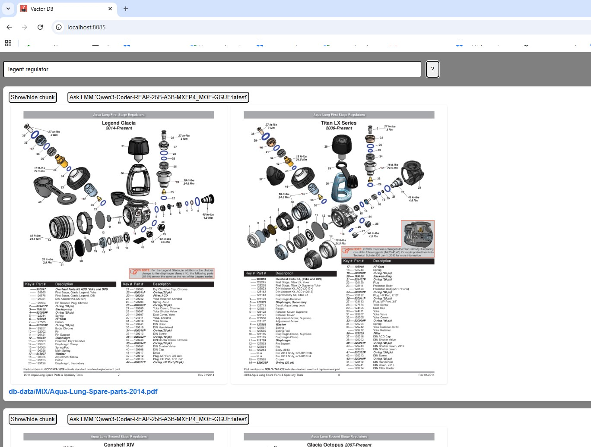
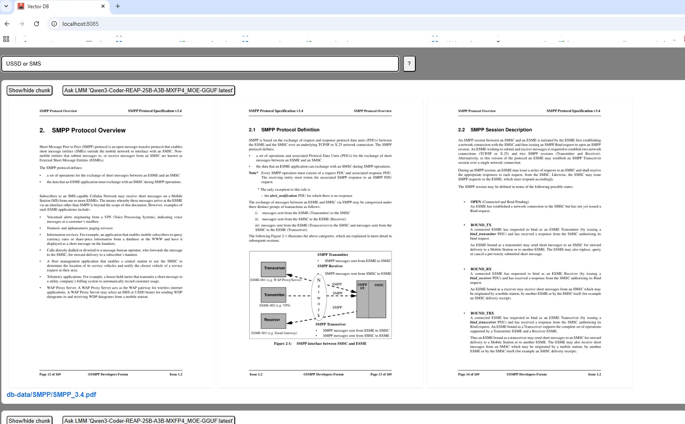
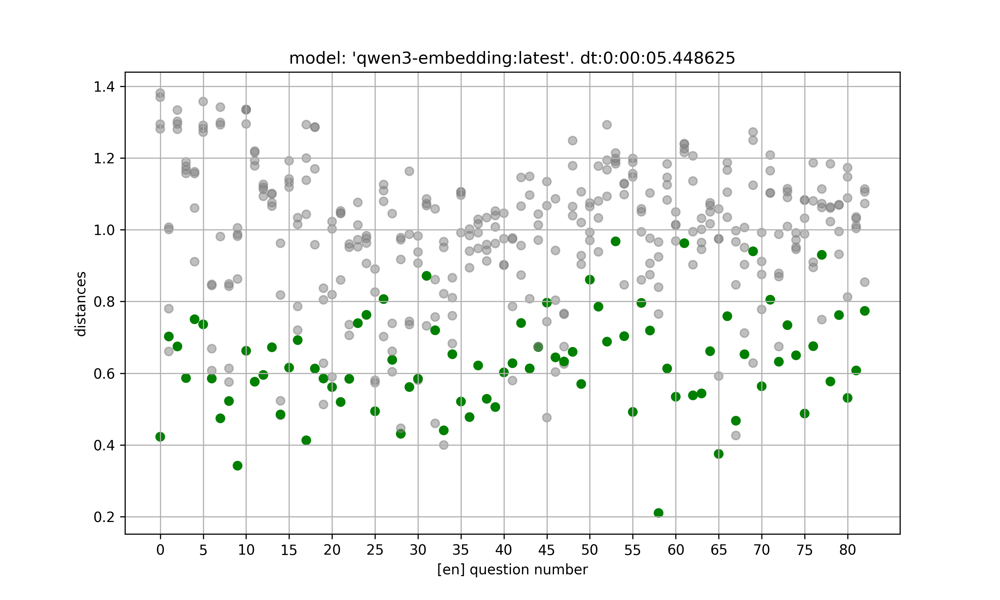
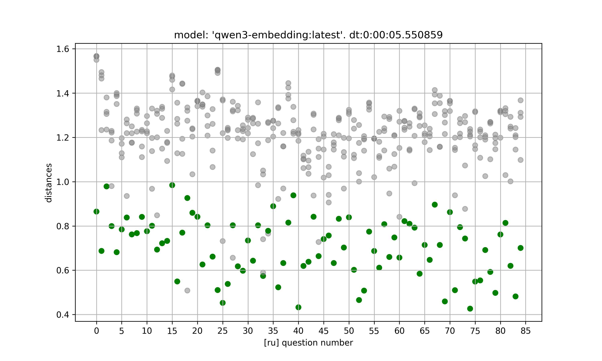
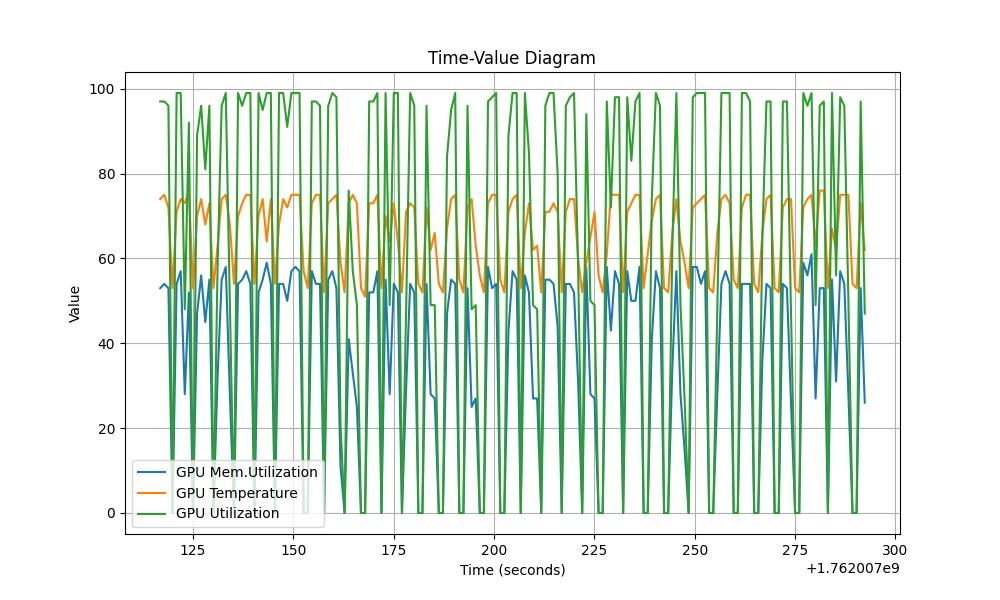

# Построение локальной векторной БД (справочной системы) по pdf файлам.

Репозиторий содержит ПО на python (использована v3.13) для задачи поиска документа по контекстной строке.

Тестировалось и отлаживалось на 
* Сервер (Linux 24.04) с ollama (v0.12.3). nvidia драйвер v580.95.05. CUDA v13.0, docker версия qdrant/qdrant
  * 32Gb ОЗУ
  * RTX 5060ti 16Gb
* рабочий ноутбук с Windows и документацией размером около 2Гб
  * 32Gb ОЗУ

Состав ПО:
* confluence2pdf.py - конвертация всех станиц space Confluence в pdf файлы  
  * опциональный модуль. Для его работы нужно "pip install atlassian-python-api"
  * модуль повторно грузит повторно только те страницы у которых изменилась дата редактирования. Удаляя ембеддинг после загрузки.
  * опциональная настройка в config.yml confluence/date_threshold - не грузить совсем старые страницы. Confluence 
  * для дальнейшей обработки выгруженных pdf, нужно запускать "python main.py"
* main.py + py_src - основное ПО
  * main.py в зависимости от ключей запуска
    * Запуск процесс обработки данных 
    * Запуск HTTP сервера по обработанным и загруженным в qdrant данным 
  * Запуск процесс обработки данных _python main.py_
    * py_src/data_converters/pdf2data.py - предварительная обработка всех новых pdf файлов (нет в config.yml/path.output)  
      * поиск всех pdf файлов, рекурсивно, во всех каталогах, начиная с указанного в config.yml/path.input
      * Для каждого pdf файла 
        * создание в config.yml/path.output файла doc_data.json, содержащего тексты страниц (остаются только тексты)
        * создания файлов pN.png, где N - номер страницы в PDF
    * py_src/data_converters/data2chunks.py - создание chunk по файлам doc_data.json. Запись результатов в chunks.json  
      * Модуль проходится по всем doc_data.json начиная от каталога config.yml/path.output 
      * создает файлы chunks.json, если их еще не было.
      * Для разбиения используются параметры config.yml/ollama.embedding:
          * chunk_overlap_percent - процент перекрытия данных в чанках
          * context_size - 2048 максимальный размер чанка в символах.
          * token_naive_k - 'наивный' коэффициент преобразования "сколько типично символов в токене"
    * py_src/data_converters/chunks2embedding.py - расчет вектора по каждому чанку
      * Модуль проходится по всем chunks.json начиная от каталога config.yml/path.output
      * Отсутствующие в chunks.json вектора, запрашиваются у ollama. Используются настройки в config.yml/ollama
        * url - API ollama (https://docs.ollama.com/api)
        * embedding.model - модель
    * py_src/data_converters/embedding2qdrant.py - загрузка в qdrant 
      * Модуль проходится по всем chunks.json начиная от каталога config.yml/path.output
      * Отсутствующие в qdrant чанки из chunks.json (по "id"), грузятся в qdrant. Используется настройки config.yml/qdrant
        * collection_name - имя коллекции
        * distance - метод определения 'схожести' векторов
        * top_results - сколько найденных результатов выводить
        * vector_sz - размер вектора. Должен быть согласован с конкретной моделью эмбединга
        * url (https://qdrant.github.io/qdrant/redoc/index.html)
  * Запуск HTTP сервера _python main.py --http_
    * настройки HTTP сервера в разделе config.yml/http
      * host: 0.0.0.0 - принимать запросы с любого IP
      * port: 8085 - http://localhost:8085/
      * llm - имя модели (предварительно загружена _ollama pull <имя модели>_) для опционального получения ответа на HTML станице
      * prompt_ru - системный промт на русском. Выбирается автоматически, если chunk, по которому хочется спросить LMM содержит кириллицу
      * prompt_ru - системный промт на английском
* py_tests - различные тесты. Не используются в основном ПО
  * py_tests/gpu-usage/staticstic.py - график температуры и загрузки GPU. Использует утилиту nvidia-smi. Должен запускаться на том же компе где GPU
  * py_tests/tests_local/test_local_data_chromadb.py - тест для оценки эмбединг модели на локальных данных. Не требует qdrant. 
    * Рассчитывает эмбединги по локальному списку (test_local_data_chromadb.py: 'models = [') чанков из test_local_data_en.py и test_local_data_ru.py 
    * Загружает в векторную БД chromadb (in memory) чанки + вектора
    * Пытается найти в chromadb по вопросам из test_local_data_en.py и test_local_data_ru.py чанки
    * строит график оценок результатов поиска (чанки и вопросы парные)
  * py_tests/test_db_data/test_questions_*.py - эксперименты для такой же оценки поиска, но по реальным данным 


## Запуск по шагам

### Установка ollama 
Для работы требуется установленная ollama.
Установка драйверов видеокарты и ollama это отдельная задача за рамками данного ПО.

После установки ollama, требуется загрузить как минимум две LMM. Для меня показались самые удачные:
* qwen3-embedding:latest - модель для эмбединга (вектор 4096).
* Qwen3-Coder-REAP-25B-A3B-MXFP4_MOE-GGUF:latest - модель для "ответа на вопрос с использованием чанка (опционально)"  
```
ollama pull qwen3-embedding:latest
ollama pull Qwen3-Coder-REAP-25B-A3B-MXFP4_MOE-GGUF:latest
ollama list
```

### Установка qdrant
qdrant может быть установлен в докере (самый простой путь)
```
docker pull qdrant/qdrant
docker run -d -p 6333:6333 -p 6334:6334 -v $(pwd)/local-vector-db/qdrant_storage:/qdrant/storage --name qdrant qdrant/qdrant
```
Полезные команды для понимания состояния образа и перестарта
```
docker start qdrant
docker logs -f  qdrant
docker inspect qdrant --format='{{.State.ExitCode}}'
```

## Подготовка к запуску 
Поскольку данное ПО использует ollama и qdrant API, то оно требует минимального набора библиотек и может запускаться на любом компьютере и любой OS.

### создание окружения для python и загрузка библиотек
Создание окружение сделано на примере для linux. Для Windows будет отличаться не принципиально.
Первое, что нужно сделать, создать venv для python. Например, в том же каталоге, что и main.py
И активировать его.
```
python3 -m venv .linux-venv
source ./.linux-venv/bin/activate
```
Установить минимальный набор библиотек для работы main.py
```
pip install -r ./requirements.txt
```
Если хочется запускать тесты, то нужно добавить библиотеки для них
```
pip install -r ./py_tests/tests_local/requirements.txt
```

### Настройки в файле конфигурации.
По умолчанию, используется файл ./config.yml
* http
  * llm - имя модели для "вопросу по чанку". Модель должна быть в списке _ollama list_. T.e. установленна предварительно. 
  * prompt_ru, prompt_en - системные промты (поле для экспериментов под конкретную тему документов).
* ollama
  * embedding
    * context_size - размер контекста. Не обязательно равен контексту модели. Может быть и меньше. Для обработки большого контекста может не хватить памяти GPU. И большие чанки будут приводит к нерелевантному поиску по контексту. (Поле для экспериментов)
    * chunk_overlap_percent - процент перекрытия данных для чанков. Слишком большое перекрытие может привезти увеличению количества чанков. Слишком маленькое к потере контекста.
    * token_naive_k - коэффициент 'наивного' способа определения размера чанка в токенах, исходя из байтового размера. Подбирается экспериментально. Можно смотреть на 'sudo journalctl -u ollama.service -f' в процессе расчета векторов и смотреть сколько чанков с превышением контекстного окна модели оказалось по факту. Не 'наивный' метод с явным подсчетом токенов в тексте требует существенно больше времени и ресурсов GPU
  * url - url ollama (по умолчанию ollama слушает порт 11434)
* path
  * input - каталог откуда импортируются pdf файлы в БД (readonly). Импортированные файлы можно уже в нем не держать.
  * output - каталог, где хранятся  
    * данные для экспорта в qdrant (чанки + вектора + payload со ссылками на документы и картинки страниц)
    * png картинки страниц pdf для http сервиса
    * Файлы pdf (скопированные при импорте из input) для http сервиса
* process 
  * pdf_clip - настройки для обрезки "лишней" информации из PDF файлов. Это заголовки страниц, строки с нумерацией страниц и пр.  
    * footer_height - насколько обрезать снизу (если нет настройки, то не обрезать)
    * header_height - насколько обрезать сверху (если нет настройки, то не обрезать)
    * text - фильтр для настроек footer_height + header_height. Если есть в тексте страницы такая фраза, то образать 
  * silent  false - показывать процесс обработки
* qdrant
  * collection_name - имя коллекции. Произвольное. 
  * distance - способ сравнения векторов. См. документацию на qdrant для подробностей (Dot,Cosine,Euclid,MANHATTAN). Поле для экспериментов
  * top_results - сколько выдавать результатов поиска (для тестов и http сервера)
  * url. 6333 - порт, которые по умолчанию использует qdrant 
  * vector_sz - размер вектора. Должен быть такой же, какой использует модель эмбединга


### Запуск обработки и загрузки файлов
Процедура обработки файлов запускается по 
```
python main.py
```
Может быть прервана в любой момент, не дожидаясь завершения. При повторном запуске выполнятся только необходимые для завершения обработки действия.
Для добавления новых файлов, достаточно их поместить в config.yml/path.input и запустить обработку 

БД qdrant может быть удалена в любой момент и загружена снова. Данные для загрузки хранятся в фалах chunks.json и из них идет загрузка.
Время загрузки существенно (на порядок минимум) меньше чем время расчета эмбединга и в удаление БД нет ничего критичного. 

Удалить можно разными способами (см. документацию qdrant). Самый простой - это вызов API
'DELETE http://host:port/collections/<collection name>' 
например:
```
curl -v -X DELETE http://192.168.0.101:6333/collections/my_documents
curl -v http://192.168.0.101:6333/collections
```

### Запуск http сервиса.
Сервис одностраничный и сделан в минималистичном варианте под 'домашнее использование'
примеры на основе произвольно взятых документов.
Станица выглядит как то так:




## Тесты разных эмбединг моделей 
Эксперименты показали, что выбор модели очень сильно адекватность контекстного поиска по документам.
Для анализа разных моделей пришлось создать отдельный тест на искусственных данных.
Данные созданы LLM в виде "текст + вопрос по тексту".
Перед запуском теста нужно изменить в коде test_local_data_chromadb.py блок
`
    models = [
        'qwen3-embedding:0.6b',
        'qwen3-embedding:latest',
        'bge-large:latest',
        'mxbai-embed-large:latest',
        'nomic-embed-text:latest',
        'evilfreelancer/enbeddrus:latest',
        'embeddinggemma:latest',
    ]
`
Занеся туда фактически загруженные в ollama модели для эмбединга, по которым хочется получить статистику.

Для запуска тестов нужно выполнить (пример)
```
cd ./py_tests/tests_local
python test_local_data_chromadb.py
```

Результат выполнения будет помещен в ./py_tests/tests_local/plt

Примеры для модели qwen3-embedding:latest (лучшие результаты из всех)



Однако, модель qwen3-embedding:latest имеет самый большой размер в 4.7GB и при работе сильно нагружает GPU
Для эмбединга поисковых вопросов это не принципиально, но при обработке исходных документов вентилятор шумит сильно.


